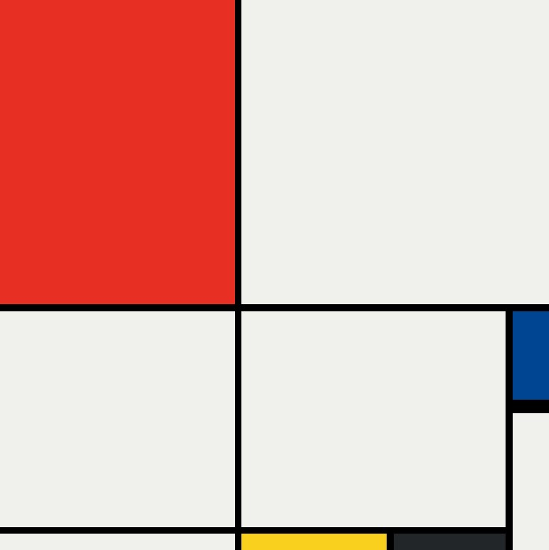

# 🎨 Mondrian Project

Reproduction of Piet Mondrian's artwork - 'Composition No. III, with red, blue, yellow, and black, 1929' in HTML5 and CSS3.

## 📸 Mondrian Project Preview



## ⚙️ Features

-  ✅ CSS Grid

## 👨🏻‍💻 Technologies Used

-  HTML5 & CSS3

## 🏁 Getting Started

Follow these steps to set up and run the mondrian project on your local machine.

### 📋 Prerequisites

Make sure you have:

-  A modern web browser (Chrome, Firefox, Edge, Safari)
-  A text editor (VS Code, Sublime Text, etc.)

## 🚀 Installation & Usage

1️⃣ **Download or Clone the Project**

-  **Manual Download**:
   1. Click on the **Code** button at the top of the GitHub page.
   2. Select **Download ZIP** and extract the folder on your PC.
-  **Using Git (optional)**:

   ```bash
   git clone https://github.com/YannWoj/Mondrian-Project.git
   ```

   2️⃣ **Open the Project**

-  Open the folder in **VS Code** or any text editor.

   3️⃣ **Run the Mondrian Project**

-  **Method 1**: Double-click on `index.html` to open it in your web browser.
-  **Method 2 (Live Server)**:
   1. Install the **Live Server** extension in VS Code.
   2. Right-click `index.html` > **"Open with Live Server"**.

## 🙏 Acknowledgements & Copyright

A huge thank you to Piet Mondrian for inspiring this project.
All artwork is © Piet Mondrian.
This project is solely intended for educational and demonstrative purposes.
